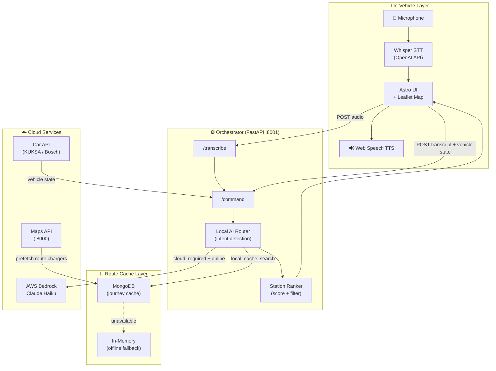
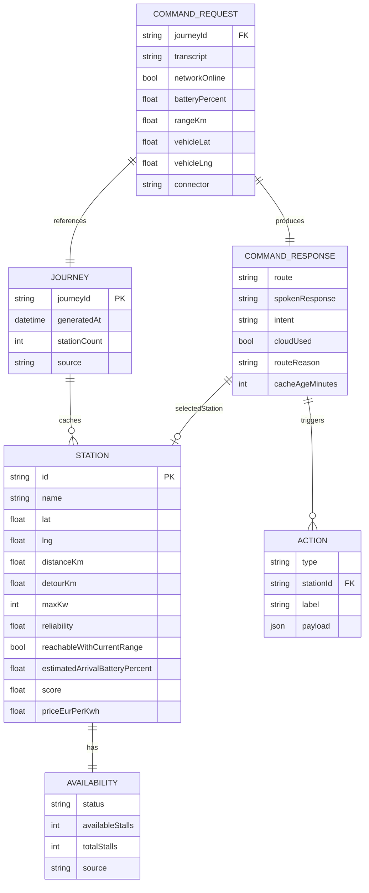
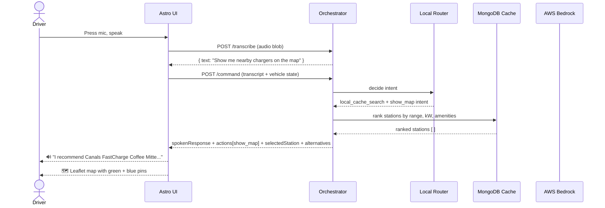
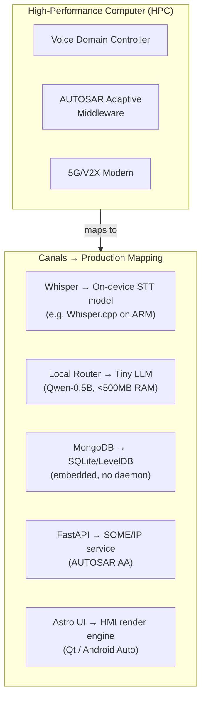

<div align="center">

#  Canals

### *The voice that drives with you — even when the cloud doesn't.*

**Hybrid AI-powered in-vehicle voice assistant for EV charging control.**  
Local-first. Cloud-optional. Always responsive.

[](https://bcw.bosch-connected-world.com/)
[](https://aws.amazon.com/bedrock/)
[](https://www.mongodb.com/)
[](https://fastapi.tiangolo.com/)
[](https://astro.build/)

---

🔗 **[Live Demo →](https://your-production-url-here.com)** &nbsp;|&nbsp; 📖 **[API Docs →](http://localhost:8001/docs)** &nbsp;|&nbsp; 🎥 **[Pitch Deck →](#)**

---

</div>

## The Problem

Today's in-vehicle voice assistants are **entirely cloud-dependent**. Dead zones, highway tunnels, weak LTE — and your assistant goes silent. For an EV driver asking *"Where is the next charging port for my electric car?"* this isn't just inconvenient. It's a broken experience at exactly the wrong moment.

| Pain Point | Status Quo | Canals |
|---|---|---|
| **Offline reliability** | ❌ Full failure | ✅ Local-first always responds |
| **Latency** | ❌ 800ms+ round-trip | ✅ <50ms local path |
| **EV-specific context** | ❌ Generic assistants | ✅ Range-aware, connector-aware |
| **Live charger data** | ❌ Stale or none | ✅ Cloud-enriched when online |
| **Map visualisation** | ❌ Text only | ✅ Interactive charger map |

---

##  The Canals Approach 🧠

```
"Show me fast chargers with coffee near me"
         │
         ▼
  ┌─────────────┐     always runs first, <50ms
  │ Local Router│─────────────────────────────────► Local cache hit? ──► Spoken response
  └─────────────┘                                                         + Map pins
         │ needs live data AND online
         ▼
  ┌─────────────┐
  │ AWS Bedrock │─────────────────────────────────► Enriched live data ──► Response
  └─────────────┘
         │ needs live data AND offline
         ▼
  ┌─────────────┐
  │ Cache + warn│─────────────────────────────────► Stale-aware answer
  └─────────────┘
```

The **local model decides first, every time**. Cloud is only called when the user explicitly needs current data *and* is online. This mirrors how production automotive software must behave under ISO 26262 functional safety principles.

---

##  System Architecture 🗺️



---

##  Data Model 🏗️



---

##  Voice Command Flow 🔀



---

##  System Boundaries 🗂️

```mermaid
graph LR
    subgraph Edge["Edge (Always Available)"]
        A["Local AI Router"]
        B["MongoDB Cache<br/>prefetched on journey start"]
        C["In-memory fallback"]
        D["Astro UI + Leaflet"]
        E["Web Speech API TTS"]
    end

    subgraph Hybrid["Hybrid (Online-enhanced)"]
        F["Whisper STT<br/>OpenAI API"]
        G["AWS Bedrock<br/>Live availability / pricing"]
        H["Maps API<br/>Route-prefetch"]
    end

    subgraph External["External Integrations"]
        I["KUKSA Vehicle API"]
        J["Bosch Car API"]
        K["Charging network APIs"]
    end

    Edge -->|"triggers when online"| Hybrid
    Hybrid -->|"enriches"| Edge
    External -->|"vehicle state + lights"| Edge
```



**What always works offline:**
- Battery / range queries
- Station search from journey cache
- Navigate to previously selected station
- Map display of cached stations
- Lights on/off via Car API (direct CAN)

**What requires connectivity:**
- Live charger availability
- Real-time pricing
- Fresh route-based charger prefetch

---

## 🔧 Tech Stack

| Layer | Technology | Why |
|---|---|---|
| **Voice input** | OpenAI Whisper | Best-in-class multilingual STT |
| **Voice output** | Web Speech API | Zero-latency, no cloud needed |
| **Local router** | Python + custom NLP | <50ms, no model download |
| **Cloud AI** | AWS Bedrock (Claude Haiku) | Cost-efficient, low latency |
| **Backend** | FastAPI + Python | Auto-docs, async, typed |
| **Route cache** | MongoDB | Offline-resilient document store |
| **Maps** | Leaflet.js + OpenStreetMap | MIT licensed, no API key |
| **Frontend** | Astro.js | Zero JS by default, fast |
| **Vehicle API** | KUKSA Data Broker | Open standard for in-vehicle signals |
| **Infrastructure** | Docker Compose | One-command local stack |

---

## 🚘 Real-World Car Implementation

### How Canals Maps to Production Automotive Architecture



### Production Benefits

| Metric | Cloud-only | Canals Local-First |
|---|---|---|
| **Response latency** | 800–2000ms | **40–80ms** |
| **Offline uptime** | 0% | **~95% of commands** |
| **Data cost/vehicle/month** | ~2GB | **~200MB** (cloud top-up only) |
| **GDPR risk** | High (voice in cloud) | **Low** (audio stays on-device) |
| **Functional safety** | Degraded mode only | **Full fallback design** |

### Cost Model at Scale (Fleet of 100k Vehicles)

```
Cloud-only architecture
  └─ 100k vehicles × 200 commands/day × 365 days
  └─ ~730M API calls/year
  └─ ~€2.2M/year in LLM API costs alone

Canals local-first
  └─ 95% resolved locally → 36.5M cloud calls/year
  └─ ~€110k/year (-95% cloud cost)
  └─ One-time: ~€15/vehicle embedded compute upgrade
  └─ Break-even: < 3 months at fleet scale
```

---

## 📊 Analytics & Testing

**Key metrics:** local resolution rate (target >90%), P95 local latency (<80ms), offline fallback triggers (<5%), STT word error rate (<8%).

**At Bosch scale:** start with pytest unit coverage on the router, replay real EV driver intents against the orchestrator, then a 50-vehicle opt-in pilot with A/B against cloud-only — measuring task completion rate offline as the primary KPI.

---

## 🔮 What's Next

- **Proactive range alerts** — warn the driver before they ask
- **Multi-stop planning** — "plan Berlin → Munich with charges"
- **On-device Whisper.cpp** — eliminate the STT API call entirely
- **V2X slot reservation** — charger broadcasts directly to the car
- **Android Auto / CarPlay HMI** — native head-unit integration
- **AUTOSAR Adaptive port** — production-ready SOME/IP service

---

## 👥 Team

| Name | Role | GitHub |
|---|---|---|
| **Abdulla** | Web UI · Map integration · Backend routing | [@abdalla980](https://github.com/abdalla980) |
| **Alex** | Frontend · Backend | [@TBD](#) |
| **Christian** | Backend · Software Architecture · ML | [@TBD](#) |
| **Li** | Product Design · UX · Product Journey | [@TBD](#) |
| **Nico** | Automation · Business · Product | [@TBD](#) |
| **Sofiia** | TBD | [@TBD](#) |

> **Challenge:** Voice Assistant for Vehicle Control — Future Mobility (Automotive)
> **Event:** [Bosch Connected Experience 2026](https://bcw.bosch-connected-world.com/) · BCX26

---

## 🚀 Quick Start

### One-command stack (Docker)

```bash
docker compose up --build
```

| Service | URL |
|---|---|
| Voice UI | http://localhost:4321 |
| Orchestrator API | http://localhost:8001 |
| API Docs (Swagger) | http://localhost:8001/docs |
| Maps API | http://localhost:8000 |
| MongoDB | localhost:27017 |

### Local development

```bash
# Backend
cd backend/orchestrator
python3 -m venv .venv && source .venv/bin/activate
pip install -r requirements.txt
uvicorn app.main:app --reload --port 8001

# Frontend (separate terminal)
cd ui
npm install && npm run dev
```

Set environment variables for full cloud features:

```bash
OPENAI_API_KEY=sk-...          # Whisper STT
AWS_BEDROCK_ENABLED=true       # Live availability via Claude Haiku
AWS_REGION=eu-central-1
MONGODB_URI=mongodb://...      # Optional — falls back to memory
```

---

## 📁 Project Structure

```
canals/
├── ui/                         # Astro.js voice UI + Leaflet map
├── backend/
│   └── orchestrator/           # FastAPI — command routing + cache
├── maps-api/                   # Route-based charger prefetch
├── car-api/                    # KUKSA / Bosch vehicle signals
├── cache-service/              # MongoDB journey cache service
├── bedrock/                    # AWS Bedrock integration
├── infrastructure/             # Terraform / deployment
├── e2e/                        # End-to-end test suite
└── docker-compose.yml          # Full local stack
```

---

<div align="center">

Built with ❤️ at **Bosch Connected Experience 2026**

*Bosch · AWS · MongoDB*

</div>
