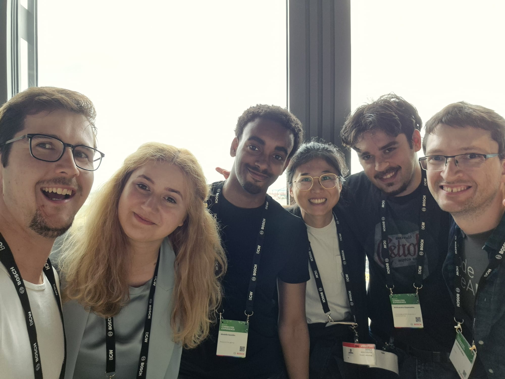
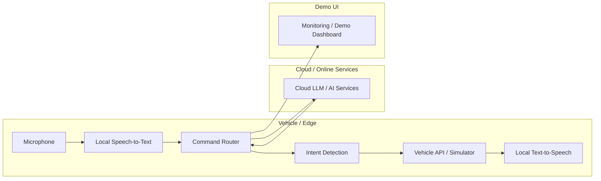

# **Your Team at a Glance**

## **Team Name / Tagline**

**TBD**  
*Hybrid voice control for vehicles — local-first, cloud-optional.*

> 💡 **Tip:** Create a sheet of paper with your team name on the desk so mentors and organizers can find you easily! 

## **Team Members**

| Name | GitHub Handle | Role(s) |
| :--- | :--- | :--- |
| Abdulla | TBD | Development |
| Alex | TBD | Frontend, Backend |
| Christian | TBD | Backend, Software Architecture, ML/CV |
| Li | TBD | Product Design, UX, Product Journey |
| Nico | TBD | Automation, Business / Product |
| Sofiia | TBD | TBD |

## **Challenge**

**Voice Assistant for Vehicle Control**  
Future Mobility (Automotive)

## **Core Idea**

We are building a **hybrid AI-powered in-vehicle voice assistant** for vehicle control.

The idea is to use a **local-first architecture** so core voice commands can still work with low latency and without a permanent cloud connection. When connectivity is available, the system can route more advanced tasks to online services, but the essential vehicle-control flow should remain available offline or semi-online.

Our prototype focuses on:
- voice interaction in an **automotive context**
- **edge/cloud routing** depending on latency and availability
- reliable fallback behavior when cloud services are unavailable
- integration with a vehicle API, simulator, or mocked backend for the demo

 

*[Sketch your technical architecture or data flow to help understand your technical approach. You can edit the mermaid chart below:]*

