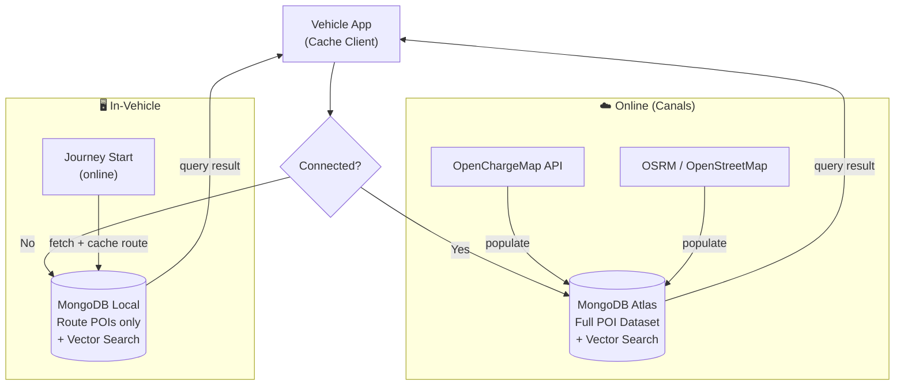

# Cache Requirements

## Purpose

General-purpose route cache for all POI types needed during a journey.
Fetched online at journey start, queryable offline while driving.

## Input

A journey definition: `start (lat, lng)` → `end (lat, lng)`

The GPS path between start and end is resolved via [[Tech Stack#Open Services]] (OSRM), returning road-accurate waypoints. POIs are fetched along those waypoints.

## POI Types to Cache

| Type | Source |
|------|--------|
| EV Charging Stations | OpenChargeMap API |
| Gas Stations | OpenStreetMap / Overpass |
| Hotels / Places to Sleep | OpenStreetMap |
| Workshops / Car Garages | OpenStreetMap |
| Hospitals / Emergency | OpenStreetMap |
| Local Points of Interest | OpenStreetMap |

## MongoDB Architecture



**Online** → MongoDB Atlas: full global dataset, live updates, rich vector search.
**Offline** → Local MongoDB: route snapshot only. Independent from Atlas, not synced.

## Document Schema

```json
{
  "source_id": "string",
  "poi_type": "ev_charging | gas_station | hotel | workshop | hospital | poi",
  "name": "string",
  "location": { "type": "Point", "coordinates": [lng, lat] },
  "address": "string",
  "town": "string",
  "country": "string",
  "metadata": {},
  "embedding": [0.1, 0.2, "..."],
  "journey_id": "string",
  "cached_at": "ISO8601"
}
```

## Query Modes

| Mode | Method | Needs Cloud? |
|------|--------|-------------|
| Geospatial | `$near` on `location` | No |
| Keyword | `$text` index | No |
| Semantic | `$vectorSearch` on `embedding` | No (local embeddings) |

## Local Docker Setup

```yaml
services:
  mongodb:
    image: mongodb/mongodb-atlas-local:latest
    ports:
      - "27017:27017"
```

Run with: `just db`

## Links

- [[Use Case]]
- [[Tech Stack]]
- [[Challenge]]
