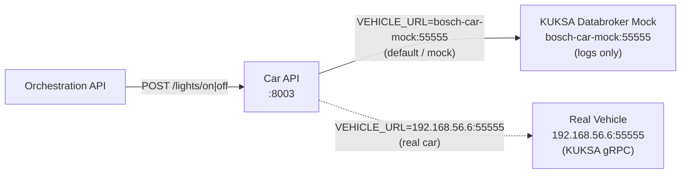

# Car API

REST API for vehicle control commands. Exposes vehicle functions (lights, etc.) over HTTP with Swagger UI.

## Start

```bash
docker compose up -d car-api bosch-car-mock
```

Swagger UI: [http://localhost:8003/docs](http://localhost:8003/docs)

> **Orchestrator** (running inside Docker) must use the internal URL `http://car-api:8003` — not `localhost`.

## Endpoints

| Method | Path | Description |
|--------|------|-------------|
| `POST` | `/lights/on` | Turn lights on |
| `POST` | `/lights/off` | Turn lights off — also logs the call |

## Configuration

| Variable | Default | Description |
|----------|---------|-------------|
| `VEHICLE_URL` | `bosch-car-mock:55555` | KUKSA databroker host:port |

Set in `.env`. For the real Bosch car: `VEHICLE_URL=192.168.56.6:55555`
For local development the mock is used automatically via [[docker-compose]].

> **Docker internal URL**: The `car-api` container reaches the mock via `bosch-car-mock:55555` (Docker service name). This is set explicitly in `docker-compose.yml` under `car-api → environment`, overriding any `.env` value. Local scripts on the host use `localhost:55556` instead.

## Architecture



The target vehicle is selected entirely by the `VEHICLE_URL` environment variable — no code change needed to switch between mock and real car.

## Links

- [[Car Mock]] — local KUKSA databroker mock, logs all signal writes
- [[Car Vehicle]] — real Bosch demo car, VSS signals, environment matrix
