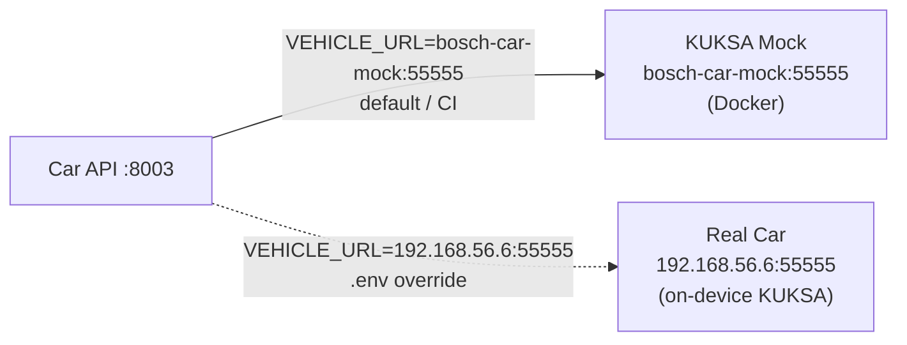

# Car Vehicle (Bosch Demo Car)

The real Bosch mini demo car that the system controls in production. Runs its own KUKSA databroker on-device. The [[Car API]] connects to it by changing one environment variable.

## Connect

Switch from mock to real car by setting `VEHICLE_URL` in `.env`:

```env
VEHICLE_URL=192.168.56.6:55555
```

No code changes needed — the `car-api` reads this at startup.

> The car and the laptop/Jetson must be on the same network (or VPN). The car runs its own KUKSA gRPC server on port `55555`.

## VSS Signals

The car exposes a custom signal set (not standard VSS 6.0):

| VSS Path | Type | Description |
|----------|------|-------------|
| `Vehicle.RequestTakeOver` | actuator (string) | Claim control before any command. Format: `[priority, client_id]` |
| `Vehicle.Body.Lights.ExteriorLightControl` | actuator (string) | Turn lights on/off. Format: `[on/off, light_id, client_id]` |

## Signal Values

**RequestTakeOver**
```python
"[1, 120]"    # priority=1, client_id=120
```

**ExteriorLightControl**
```python
"[1, 5, 120]"   # on:  on/off=1, light_id=5, client_id=120
"[0, 0, 120]"   # off: on/off=0, light_id=0, client_id=120
```

`client_id` is configurable via `VEHICLE_CLIENT_ID` env var (default `120`).

## Communication Protocol

```
car-api → KUKSA databroker (gRPC, insecure)
         set_current_values({"Vehicle.RequestTakeOver": Datapoint("[1, 120]")})
         set_current_values({"Vehicle.Body.Lights.ExteriorLightControl": Datapoint("[1, 5, 120]")})
```

Uses `kuksa-client` Python library (`VSSClient`). The connection is opened per-request and closed immediately after.

## Environment Matrix

| Scenario | `VEHICLE_URL` | Who sets it |
|----------|---------------|-------------|
| Local dev (mock) | `bosch-car-mock:55555` | `docker-compose.yml` environment block |
| Host scripts | `localhost:55556` | `.env` |
| Real car | `192.168.56.6:55555` | `.env` |

`docker-compose.yml` overrides `.env` for the `car-api` container, so the mock URL is always used in Docker even if `.env` points at the real car.

## Architecture



## Links

- [[Car API]]
- [[Car Mock]]
