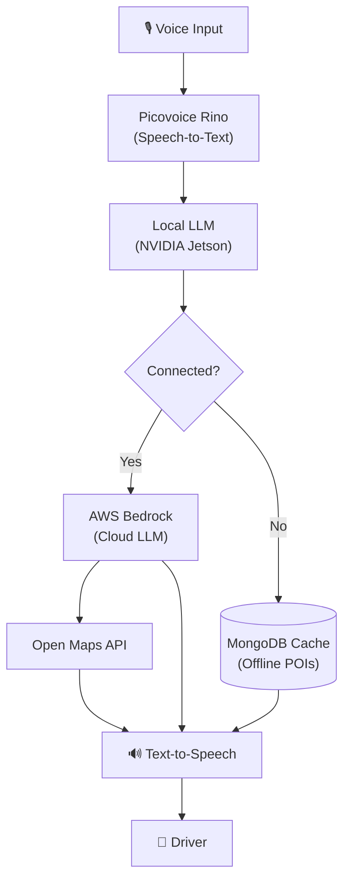

# Tech Stack

## Edge (In-Vehicle)

| Component | Technology |
|-----------|-----------|
| Hardware | NVIDIA Jetson |
| Speech-to-Text | Picovoice Rino (on-device) |
| Local LLM | Edge model (offline) |
| Cache | MongoDB |
| Text-to-Speech | On-device TTS |

## Cloud (When Connected)

| Component | Technology |
|-----------|-----------|
| Cloud LLM | AWS Bedrock |
| Maps / POI | Open Maps API |
| Infrastructure | AWS |

## Data Flow

## Links

- [[Challenge]]
- [[Problem]]
- [[Use Case]]
