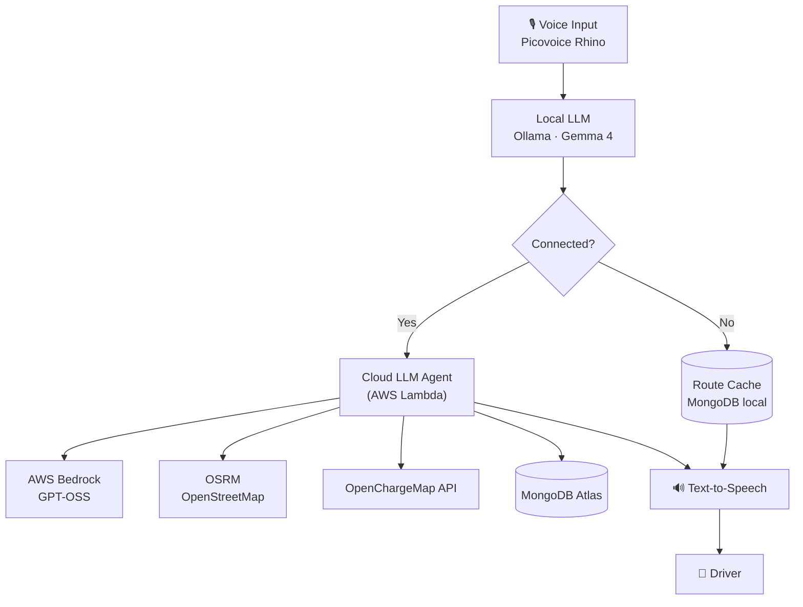

# Tech Stack

## Vehicle (Local / Edge)

| Component | Technology |
|-----------|-----------|
| Hardware | NVIDIA Jetson |
| Speech-to-Intent | Picovoice Rhino (on-device) |
| Local LLM | Ollama · Gemma 4 (offline) |
| Route Cache | MongoDB (mongodb-atlas-local, Docker) |
| Text-to-Speech | On-device TTS |
| Vehicle Control | KUKSA / Vehicle API |

## AWS

| Component | Technology |
|-----------|-----------|
| Cloud LLM Agent | AWS Lambda / Agent |
| Model | AWS Bedrock · GPT-OSS |

## Open Services

| Component | Technology |
|-----------|-----------|
| Routing | OSRM / OpenStreetMap |
| EV Data | OpenChargeMap REST API |

## MongoDB (Canals)

| Component | Technology |
|-----------|-----------|
| Cloud Database | MongoDB Atlas |
| Vector Search | Atlas Vector Search |

## Data Flow

## Links

- [[Challenge]]
- [[Problem]]
- [[Use Case]]
- [[Cache Requirements]]
