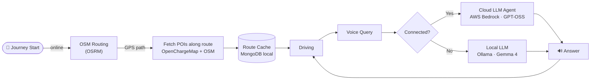

# Use Case — Highway Journey

## Scenario

Driver travels between cities (e.g. France → Germany) on a highway.

## Flow

## Queries the Assistant Handles

| Query | Offline? |
|-------|----------|
| "Where's the nearest gas station?" | ✅ |
| "Find an EV charger nearby" | ✅ |
| "I need a place to sleep" | ✅ |
| "Find a workshop / garage" | ✅ |
| "Nearest hospital" | ✅ |
| "I need water / food nearby" | ☁️ online only |
| "Book a hotel" | ☁️ online only |
| Heart rate alert → suggest hospital | ✅ cached locations |

## Cached POI Categories

- Gas stations
- EV charging stations (via OpenChargeMap)
- Hotels / places to sleep
- Workshops / car garages
- Hospitals / emergency services
- Local points of interest

## Links

- [[Challenge]]
- [[Problem]]
- [[Tech Stack]]
- [[Cache Requirements]]
